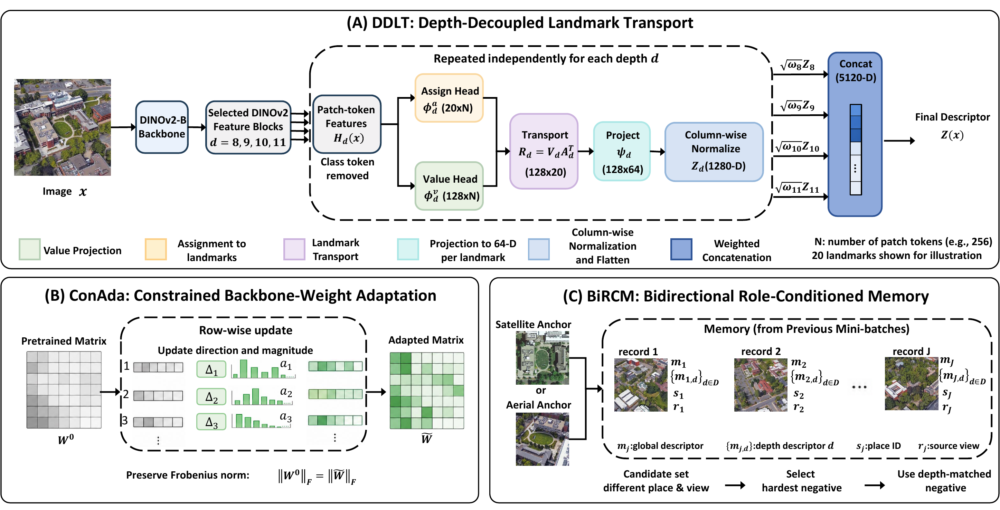
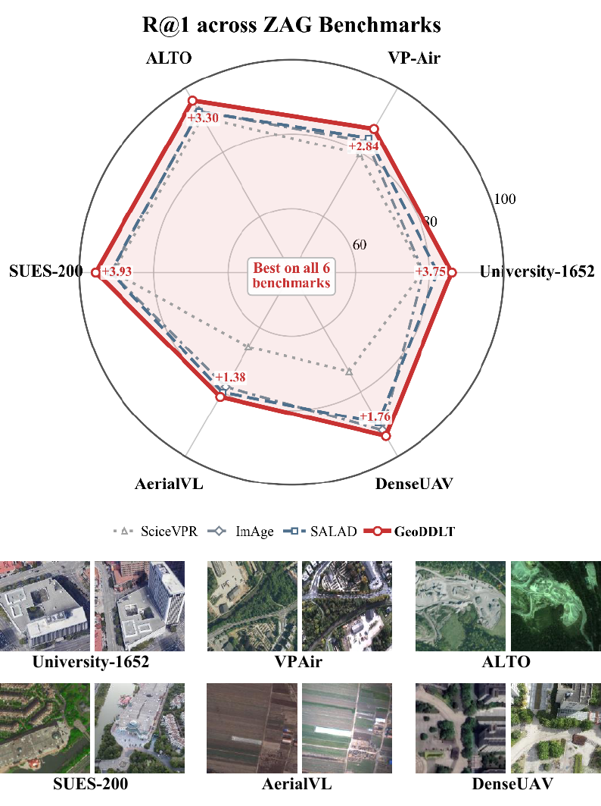
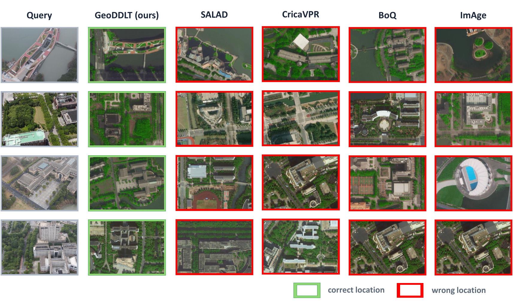
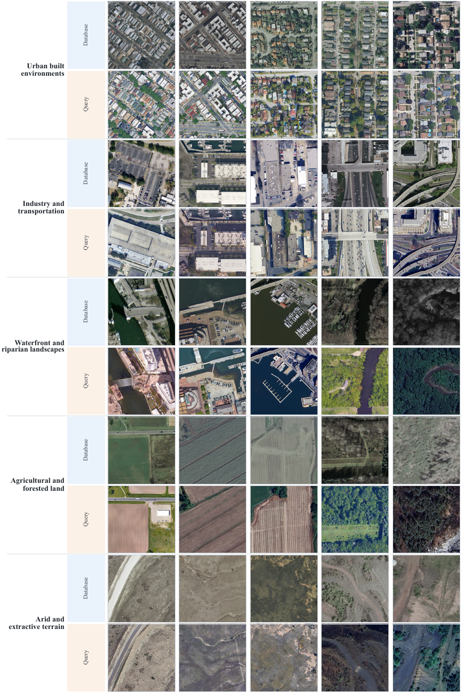

# GeoDDLT

**Depth-Decoupled Landmark Transport for Large-Scale Aerial Visual Geo-Localization**

GeoDDLT is an aerial visual place recognition framework for robust aerial-satellite retrieval. It learns complementary representations from multiple foundation-model depths and optimizes the backbone for cross-view matching. The project also introduces **Aero-Cities**, a large-scale aerial-satellite training dataset, and **ZAG**, a zero-shot evaluation suite built from six public datasets.

  

## Open-Source Contents

Source code, pretrained weights, and datasets will be released upon acceptance. For early access, please contact us by email.

- **Model code:** [`./src/`](./src/)
- **Pretrained weights:** [`./checkpoints/`](./checkpoints/)
- **Aero-Cities dataset:** [`./data/Aero-Cities/`](./data/Aero-Cities/)
- **ZAG evaluation suite:** [`./data/ZAG/`](./data/ZAG/)

## Main Results

All methods below are trained on Aero-Cities and evaluated on the complete ZAG benchmark without fine-tuning on any target dataset. R@1 and R@5 are unweighted averages across the six public datasets.

| Method | Descriptor dimension | Mean R@1 (%) | Mean R@5 (%) |
|---|---:|---:|---:|
| SALAD | 8,448 | 86.05 | 94.05 |
| BoQ | 12,288 | 82.46 | 91.86 |
| ImAge | 6,144 | 86.06 | 93.77 |
| SciceVPR | 4,096 | 79.86 | 91.44 |
| **GeoDDLT** | **5,120** | **90.03** | **95.88** |

GeoDDLT ranks first in R@1 on all six public datasets and first in R@5 on five of them.

  

### Qualitative Results

GeoDDLT correctly retrieves the matching satellite images in challenging cases where the competing methods fail.

  

## Resources

### Aero-Cities Dataset

Aero-Cities contains more than 325,000 aligned aerial-satellite images across approximately 500 km² of urban and natural regions. The examples below show paired database and query images from five broad scene groups.

  

## Citation

Citation information will be added after publication.
